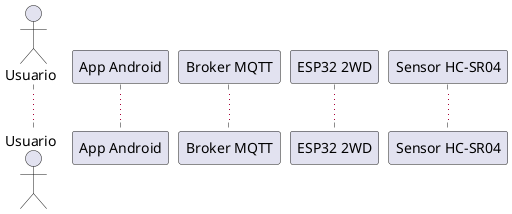

# Robot 2WD con detección de obstáculos, MQTT seguro y app Android (control + voz)

Proyecto de un robot 2WD basado en **ESP32** con:

- Sensor ultrasónico HC-SR04 para **detección de obstáculos** (freno automático).
- Publicación de telemetría en **MQTT con TLS** (HiveMQ Cloud / Mosquitto).
- **API REST** en el ESP32 para control remoto:
  - `GET /api/v1/healthcheck`
  - `GET/POST /api/v1/move`
- Aplicación Android nativa con dos modos:
  - **Mando** (botones) → `ControlActivity`
  - **Voz + IA (OpenAI)** → `VoiceActivity`
- Uso de **variables de preprocesador** y constantes para facilitar la configuración.

---

## Arquitectura general

Componentes principales:

- **ESP32 2WD**
  - Control de motores (4 pines).
  - Lectura HC-SR04.
  - Servidor HTTP embebido (`WebServer`) para el API REST.
  - Cliente MQTT seguro (`WiFiClientSecure` + `PubSubClient`) hacia HiveMQ Cloud.
  - Publicación periódica de telemetría de distancia y publicación de IP.

- **Broker MQTT (TLS/SSL)**
  - Servidor en la nube (e.g. HiveMQ Cloud) con puerto **8883**.
  - Certificado raíz de **ISRG Root X1 (Let’s Encrypt)**.

- **App Android**
  - **MainActivity**: pantalla principal (elige Mando o Voz).
  - **ControlActivity**:
    - Se conecta por MQTT (TLS) a `test.mosquitto.org:8883` (configurable).
    - Se suscribe a `car/telemetry/#` y `car/info/ip`.
    - Envía comandos REST al robot usando la IP recibida por MQTT.
  - **VoiceActivity**:
    - Graba audio y lo envía a **OpenAI** (Whisper + GPT-4o-mini).
    - Convierte texto de voz en comandos `["adelante","atrás","izquierda","derecha","parar"]`.
    - Ejecuta los comandos contra el robot vía REST.
    - Muestra telemetría por MQTT.

### Diagrama de secuencia (PlantUML)

El diagrama de secuencia se encuentra en `docs/sequence_robot.puml`.  
Código (resumen):

(ver archivo completo en /docs/sequence_robot.puml) ...

## Aporte creativo/técnico (Nivel EXPERTO)

Para alcanzar el nivel **EXPERTO** de la rúbrica, el proyecto integra dos modelos de inteligencia artificial de OpenAI dentro de la app Android (modo voz):

1. **gpt-4o-mini-transcribe**  
   - Se usa en el endpoint `https://api.openai.com/v1/audio/transcriptions`.  
   - Recibe el audio grabado desde el micrófono del celular (`voice_command.m4a`).  
   - Devuelve el **texto transcrito** de lo que dice el usuario.  
   - Modelo usado: `"model": "gpt-4o-mini-transcribe"`.

2. **gpt-4o-mini**  
   - Se usa en el endpoint `https://api.openai.com/v1/chat/completions`.  
   - Recibe como entrada el texto transcrito y un *prompt* que indica:
     - Que solo debe responder con una lista de comandos válidos para el carro:
       - `adelante`, `atras`, `izquierda`, `derecha`, `parar`.
     - Formato de respuesta: `["adelante","izquierda","parar"]`.
   - Modelo usado: `"model": "gpt-4o-mini"`.

### Flujo completo del modo voz + IA

1. El usuario mantiene presionado el botón de micrófono en `VoiceActivity`.
2. La app:
   - Graba el audio con `MediaRecorder`.
   - Envía el archivo a **gpt-4o-mini-transcribe** para obtener el texto.
3. Con ese texto, la app construye un prompt y lo envía a **gpt-4o-mini**.
4. El modelo devuelve una lista de comandos (por ejemplo `["adelante","adelante","parar"]`).
5. La app ejecuta cada comando con un `POST /api/v1/move` contra el ESP32.
6. El ESP32:
   - Verifica distancia con el sensor HC-SR04.
   - Aplica freno automático si hay obstáculo.
   - Publica telemetría por MQTT, que se muestra en la app.

Con esto, el robot se puede controlar **por voz** usando IA, cumpliendo el criterio de:
> “Integrar algún API o modelo de inteligencia artificial (YOLO, OpenAI, etc.)”

