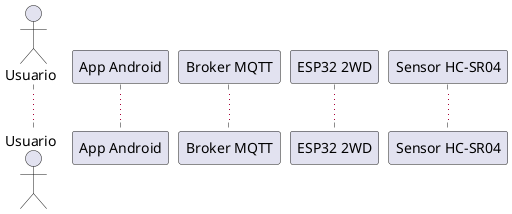

# Robot 2WD con detección de obstáculos, MQTT seguro y app Android (control + voz)

Proyecto de un robot 2WD basado en **ESP32** con:

- Sensor ultrasónico HC-SR04 para **detección de obstáculos** (freno automático).
- Publicación de telemetría en **MQTT con TLS** (HiveMQ Cloud / Mosquitto).
- **API REST** en el ESP32 para control remoto:
  - `GET /api/v1/healthcheck`
  - `GET/POST /api/v1/move`
- Aplicación Android nativa con dos modos:
  - **Mando** (botones) → `ControlActivity`
  - **Voz + IA (OpenAI)** → `VoiceActivity`
- Uso de **variables de preprocesador** y constantes para facilitar la configuración.

---

## Arquitectura general

Componentes principales:

- **ESP32 2WD**
  - Control de motores (4 pines).
  - Lectura HC-SR04.
  - Servidor HTTP embebido (`WebServer`) para el API REST.
  - Cliente MQTT seguro (`WiFiClientSecure` + `PubSubClient`) hacia HiveMQ Cloud.
  - Publicación periódica de telemetría de distancia y publicación de IP.

- **Broker MQTT (TLS/SSL)**
  - Servidor en la nube (e.g. HiveMQ Cloud) con puerto **8883**.
  - Certificado raíz de **ISRG Root X1 (Let’s Encrypt)**.

- **App Android**
  - **MainActivity**: pantalla principal (elige Mando o Voz).
  - **ControlActivity**:
    - Se conecta por MQTT (TLS) a `test.mosquitto.org:8883` (configurable).
    - Se suscribe a `car/telemetry/#` y `car/info/ip`.
    - Envía comandos REST al robot usando la IP recibida por MQTT.
  - **VoiceActivity**:
    - Graba audio y lo envía a **OpenAI** (Whisper + GPT-4o-mini).
    - Convierte texto de voz en comandos `["adelante","atrás","izquierda","derecha","parar"]`.
    - Ejecuta los comandos contra el robot vía REST.
    - Muestra telemetría por MQTT.
      
- **Red local**
  - IP actual del robot: `172.20.10.2` (ejemplo de uso en los endpoints).

## Diagrama de secuencia (PlantUML)

El diagrama de secuencia se encuentra en `docs/sequence_robot.puml`.  
Código (resumen):


(ver archivo completo en /docs/sequence_robot.puml) ...

## Firmware ESP32 (Arduino C++)

Archivo principal (ejemplo): src/robot_2wd_esp32.ino.

## Configuración por preprocesador

 ```cpp

#define USE_SIMULATED 0              // 0: HC-SR04 real, 1: sensor simulado

// Wi-Fi
#define WIFI_SSID "FreeWIFI_09"
#define WIFI_PASS "eduard09"

// MQTT (HiveMQ Cloud con TLS)
#define MQTT_SERVER "e772b5c02ba747c792bf576e640bab45.s1.eu.hivemq.cloud"
#define MQTT_PORT   8883
#define MQTT_USER   "eduardmeza09"
#define MQTT_PASS   "123456789eE"

// Sensor y seguridad
#define SAFE_CM                20.0f
#define DIST_MIN_CM             5.0f
#define DIST_MAX_CM           300.0f
#define PUBLISH_INTERVAL_MS   500UL
#define MAX_MOVE_DURATION_MS 5000
````

Esto permite cambiar rápidamente:

- Red WiFi
- Broker MQTT
- Distancia de seguridad
- Intervalo de telemetría
- Modo simulado vs físico
  
## Control de motores y sensor ultrasónico

- Pines de motores:
 ```cpp
#define PIN_MOTOR1A 19
#define PIN_MOTOR1B 21
#define PIN_MOTOR2A 26
#define PIN_MOTOR2B 25
````
Funciones: stopMotors(), moveForward(), moveBackward(), turnLeft(), turnRight().

- Pines del HC-SR04:
 ```cpp
#define PIN_TRIG 5
#define PIN_ECHO 18   // con divisor de voltaje
````
- Lógica de medición:
  - hcDistance():
    - Pulso TRIG de 10 µs.
    - pulseIn(PIN_ECHO, HIGH, PULSE_TIMEOUT_US).
    - Convierte a cm y limita [DIST_MIN_CM, DIST_MAX_CM].

- Anti-choques:
  - En handleDistancePublish():
    - Si cm <= SAFE_CM → stopMotors() y moving = false.

## API REST (ESP32)

Servidor HTTP: WebServer server(80);
IP actual del robot (ejemplo): 172.20.10.2.

### GET /api/v1/healthcheck

- Método: GET
- URL: http://172.20.10.2/api/v1/healthcheck
- Respuesta 200:
   ```cpp
  {
  "status": "ok"
  }

### GET /api/v1/move

Compatibilidad con query params.
- Método: GET
- URL: http://172.20.10.2/api/v1/move?direction=adelante&duration=1200
- Parámetros:
  - direction: adelante, atras, izquierda, derecha, parar
  - duration: milisegundos, rango 0–5000

Respuestas:
- 200 OK
  {"ok":true}

- 400 Bad Request
  {"error":"missing params"}

 o
 
  {"error":"invalid direction"}

 


## Aporte creativo/técnico (Nivel EXPERTO)

Para alcanzar el nivel **EXPERTO** de la rúbrica, el proyecto integra dos modelos de inteligencia artificial de OpenAI dentro de la app Android (modo voz):

1. **gpt-4o-mini-transcribe**  
   - Se usa en el endpoint `https://api.openai.com/v1/audio/transcriptions`.  
   - Recibe el audio grabado desde el micrófono del celular (`voice_command.m4a`).  
   - Devuelve el **texto transcrito** de lo que dice el usuario.  
   - Modelo usado: `"model": "gpt-4o-mini-transcribe"`.

2. **gpt-4o-mini**  
   - Se usa en el endpoint `https://api.openai.com/v1/chat/completions`.  
   - Recibe como entrada el texto transcrito y un *prompt* que indica:
     - Que solo debe responder con una lista de comandos válidos para el carro:
       - `adelante`, `atras`, `izquierda`, `derecha`, `parar`.
     - Formato de respuesta: `["adelante","izquierda","parar"]`.
   - Modelo usado: `"model": "gpt-4o-mini"`.

### Flujo completo del modo voz + IA

1. El usuario mantiene presionado el botón de micrófono en `VoiceActivity`.
2. La app:
   - Graba el audio con `MediaRecorder`.
   - Envía el archivo a **gpt-4o-mini-transcribe** para obtener el texto.
3. Con ese texto, la app construye un prompt y lo envía a **gpt-4o-mini**.
4. El modelo devuelve una lista de comandos (por ejemplo `["adelante","adelante","parar"]`).
5. La app ejecuta cada comando con un `POST /api/v1/move` contra el ESP32.
6. El ESP32:
   - Verifica distancia con el sensor HC-SR04.
   - Aplica freno automático si hay obstáculo.
   - Publica telemetría por MQTT, que se muestra en la app.

Con esto, el robot se puede controlar **por voz** usando IA, cumpliendo el criterio de:
> “Integrar algún API o modelo de inteligencia artificial (YOLO, OpenAI, etc.)”

## 9. Uso de memoria (Flash y RAM)

Uso reportado por el IDE de Arduino al cargar el sketch en el ESP32:

```text
Sketch uses 1037035 bytes (79%) of program storage space. Maximum is 1310720 bytes.
Global variables use 45860 bytes (13%) of dynamic memory, leaving 281820 bytes for local variables. Maximum is 327680 bytes.
````


## Documentación
- **Colección Postman**: Disponible en [`/docs/docs/control.postman_collection.json`](./docs/control.postman_collection.json).
- **Codigo inicial**: Disponible en [`/docs/Control.ino`](./docs/Control.ino).
- **Codigo Con sensor**: Disponible en [`/docs/ControlSensor.ino`](./docs/ControlSensor.ino).
- **Diagrma**: Disponible en [`/docs/image.svg`](./docs/image.svg).
- **Imagenes**: Disponible en [`/ima`](./ima).
## Colaboradores

- Profesor: [@fabianpaeri](https://github.com/fabianpaeri) (Docente).

- Colaborador 1: Maria Fernanda Rodriguez Chaparrro [@maferodriguezch06](https://github.com/maferodriguezch06) (Estudiante)

- Colaborador 2: Eduard Meza Salazar [@eduardmesa09](https://github.com/eduardmesa09) (Estudiante)

- Colaborador 3: Laura Valentina Rairan Gavilan [@LauraRairan](https://github.com/LauraRairan) (Estudiante)


