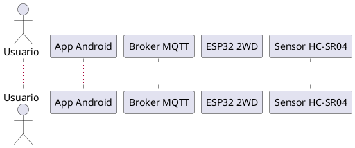

# Robot 2WD con detección de obstáculos, MQTT seguro y app Android (control + voz)

Proyecto de un robot 2WD basado en **ESP32** con:

- Sensor ultrasónico HC-SR04 para **detección de obstáculos** (freno automático).
- Publicación de telemetría en **MQTT con TLS** (HiveMQ Cloud / Mosquitto).
- **API REST** en el ESP32 para control remoto:
  - `GET /api/v1/healthcheck`
  - `GET/POST /api/v1/move`
- Aplicación Android nativa con dos modos:
  - **Mando** (botones) → `ControlActivity`
  - **Voz + IA (OpenAI)** → `VoiceActivity`
- Uso de **variables de preprocesador** y constantes para facilitar la configuración.

---

## Arquitectura general

Componentes principales:

- **ESP32 2WD**
  - Control de motores (4 pines).
  - Lectura HC-SR04.
  - Servidor HTTP embebido (`WebServer`) para el API REST.
  - Cliente MQTT seguro (`WiFiClientSecure` + `PubSubClient`) hacia HiveMQ Cloud.
  - Publicación periódica de telemetría de distancia y publicación de IP.

- **Broker MQTT (TLS/SSL)**
  - Servidor en la nube (e.g. HiveMQ Cloud) con puerto **8883**.
  - Certificado raíz de **ISRG Root X1 (Let’s Encrypt)**.

- **App Android**
  - **MainActivity**: pantalla principal (elige Mando o Voz).
  - **ControlActivity**:
    - Se conecta por MQTT (TLS) a `test.mosquitto.org:8883` (configurable).
    - Se suscribe a `car/telemetry/#` y `car/info/ip`.
    - Envía comandos REST al robot usando la IP recibida por MQTT.
  - **VoiceActivity**:
    - Graba audio y lo envía a **OpenAI** (Whisper + GPT-4o-mini).
    - Convierte texto de voz en comandos `["adelante","atrás","izquierda","derecha","parar"]`.
    - Ejecuta los comandos contra el robot vía REST.
    - Muestra telemetría por MQTT.
      
- **Red local**
  - IP actual del robot: `172.20.10.2` (ejemplo de uso en los endpoints).

## Diagrama de secuencia (PlantUML)

El diagrama de secuencia se encuentra en `docs/sequence_robot.puml`.  
Código (resumen):


(ver archivo completo en /docs/sequence_robot.puml) ...

## Firmware ESP32 (Arduino C++)

Archivo principal (ejemplo): src/robot_2wd_esp32.ino.

## Configuración por preprocesador

 ```cpp

#define USE_SIMULATED 0              // 0: HC-SR04 real, 1: sensor simulado

// Wi-Fi
#define WIFI_SSID "FreeWIFI_09"
#define WIFI_PASS "eduard09"

// MQTT (HiveMQ Cloud con TLS)
#define MQTT_SERVER "e772b5c02ba747c792bf576e640bab45.s1.eu.hivemq.cloud"
#define MQTT_PORT   8883
#define MQTT_USER   "eduardmeza09"
#define MQTT_PASS   "123456789eE"

// Sensor y seguridad
#define SAFE_CM                20.0f
#define DIST_MIN_CM             5.0f
#define DIST_MAX_CM           300.0f
#define PUBLISH_INTERVAL_MS   500UL
#define MAX_MOVE_DURATION_MS 5000
````

Esto permite cambiar rápidamente:

- Red WiFi
- Broker MQTT
- Distancia de seguridad
- Intervalo de telemetría
- Modo simulado vs físico
  
## Control de motores y sensor ultrasónico

- Pines de motores:
 ```cpp
#define PIN_MOTOR1A 19
#define PIN_MOTOR1B 21
#define PIN_MOTOR2A 26
#define PIN_MOTOR2B 25
````
Funciones: stopMotors(), moveForward(), moveBackward(), turnLeft(), turnRight().

- Pines del HC-SR04:
 ```cpp
#define PIN_TRIG 5
#define PIN_ECHO 18   // con divisor de voltaje
````
- Lógica de medición:
  - hcDistance():
    - Pulso TRIG de 10 µs.
    - pulseIn(PIN_ECHO, HIGH, PULSE_TIMEOUT_US).
    - Convierte a cm y limita [DIST_MIN_CM, DIST_MAX_CM].

- Anti-choques:
  - En handleDistancePublish():
    - Si cm <= SAFE_CM → stopMotors() y moving = false.

## API REST (ESP32)

Servidor HTTP: WebServer server(80);
IP actual del robot (ejemplo): 172.20.10.2.

### GET /api/v1/healthcheck

- Método: GET
- URL: http://172.20.10.2/api/v1/healthcheck
- Respuesta 200:
   ```cpp
  {
  "status": "ok"
  }

### GET /api/v1/move

Compatibilidad con query params.
- Método: GET
- URL: http://172.20.10.2/api/v1/move?direction=adelante&duration=1200
- Parámetros:
  - direction: adelante, atras, izquierda, derecha, parar
  - duration: milisegundos, rango 0–5000

Respuestas:
- 200 OK
   ```cpp
  {"ok":true}

- 400 Bad Request
   ```cpp
  {"error":"missing params"}
 o
  ```cpp
  {"error":"invalid direction"}
````

## POST /api/v1/move

- Método: POST
- URL: http://172.20.10.2/api/v1/move
- Headers:
  - Content-Type: application/json
- Body (JSON):
  ```cpp
  {
    "direction": "adelante",
    "duration": 1200
  }

- Lógica interna:
  1. Valida que exista direction y duration.
  2. Ajusta duration al rango [0, MAX_MOVE_DURATION_MS].
  3. Lee la distancia con readDistanceCm().
  4. Si direction == "adelante" y la distancia es < SAFE_CM:
     - Detiene los motores.
     - Devuelve 409.
  5. Si es seguro:
     - Mueve el robot en esa dirección.
     - Marca moving = true y calcula endTime.

- Respuestas:
  - 200 OK
    ```cpp
    {"ok":true}
    
- 400 Bad Request
   ```cpp
    {"error":"missing body"}
o
   ```cpp
  {"error":"invalid direction"}
````
- 409 Conflict (obstáculo)
  ```cpp
  {"error":"OBSTACLE"}

Adicionalmente, el ESP32 publica cada comando recibido en el tema MQTT car/instructions.
 
## Temas MQTT

En el firmware se definen:

```c++
#define MQTT_TOPIC_CMD      "car/instructions"
#define MQTT_TOPIC_DISTANCE "car/telemetry/distance"
#define MQTT_TOPIC_EVENT    "car/events"
#define MQTT_TOPIC_INFO     "car/info/ip"
````
| Tema                     | Dirección      | Uso                                  | Ejemplo de payload                                          |
| ------------------------ | -------------- | ------------------------------------ | ----------------------------------------------------------- |
| `car/info/ip`            | ESP32 → Broker | Publica la IP del robot (retained)   | `{"ip":"172.20.10.2"}`                                      |
| `car/telemetry/distance` | ESP32 → Broker | Distancia medida + timestamp         | `{"distance_cm":37.52,"ts":1234567}`                        |
| `car/instructions`       | ESP32 → Broker | Log de comandos recibidos por el API | `{"direction":"adelante","duration":1200,"clientIP":"..."}` |
| `car/events`             | ESP32 → Broker | Reservado para eventos futuros       | *(sin uso en esta versión)*                                 |

La app Android se suscribe a:

- car/telemetry/#
- car/info/ip

## Aplicación Android
### MainActivity

- Muestra dos botones:
  - Mando → ControlActivity
  - Voz → VoiceActivity
  - 
- Pequeñas animaciones al presionar (escala 0.9 → 1.0).

### ControlActivity (modo mando)

Archivo: ControlActivity.kt
Broker MQTT:
````cpp
private val mqttServer = "ssl://test.mosquitto.org:8883"
````
- Carga el certificado de Mosquitto desde res/raw/mosquitto_org2.
- Se conecta por TLS usando MqttAsyncClient y MqttConnectOptions.
- Suscripciones:
  - car/telemetry/#
  - car/info/ip
    
- UI:
  - Botones: btnArriba, btnAbajo, btnIzquierda, btnDerecha.
  - Botón btnRevisar → healthcheck.
  - TextViews:
    - tvInfo: estado MQTT.
    - tvHealth: estado del robot (healthcheck).
    - tvComandos: log de comandos enviados.
    - tvTelemetria: telemetría recibida (distance_cm).

- Flujo:
  - Cuando llega car/info/ip por MQTT:
    - Guarda la IP en robotIp.
      
  - Al pulsar flechas:
    - Construye JSON {"direction": "...", "duration": ...}.
    - Envía POST /api/v1/move al robotIp.
    - Muestra:
      - Mensaje de éxito.
      - Mensaje de obstáculo (OBSTACLE).
      - Errores HTTP/red.

### VoiceActivity (modo voz + IA)

- Archivo: VoiceActivity.kt.
- También se conecta a ssl://test.mosquitto.org:8883 con TLS.
- Suscripciones:
  - car/telemetry/#
  - car/info/ip
    
- Elementos:
  - Botón de micrófono btnVoz.
  - Texto tipo consola (cuadroDeTexto).
  - GIF del robot (GifDrawable).
  - Telemetría (tvTelemetria).

- Flujo de voz + IA:
  1.  El usuario mantiene pulsado btnVoz:
     - Se inicia MediaRecorder.
     - Se guarda audio en voice_command.m4a.

  2. El usuario suelta el botón:
     - Se detiene la grabación.
     - Se llama a transcribeAudio(file):
       - POST https://api.openai.com/v1/audio/transcriptions
       - Modelo: "model": "gpt-4o-mini-transcribe"
       - Devuelve el campo "text" con la transcripción.

  3. Se llama a getCommandsFromAI(text):
     - Construye un prompt para convertir el texto → comandos sencillos:
       - adelante, atras, izquierda, derecha, parar.
     - Usa:
       - POST https://api.openai.com/v1/chat/completions
       - Modelo: "model": "gpt-4o-mini"
    - Devuelve una lista tipo ["adelante","izquierda","parar"].

  4. enviarComandoRest(commands):
     - Para cada comando:
       - Envía POST /api/v1/move al robotIp.
       - Interpreta respuestas:
         ````cpp
         - {"ok":true}
         - {"error":"OBSTACLE"}

  5. Paralelamente:
     - Se recibe telemetría por MQTT en car/telemetry/#.
     - La app muestra los JSON en tvTelemetria.

## Aporte creativo/técnico (Nivel EXPERTO)

Para alcanzar el nivel **EXPERTO** de la rúbrica, el proyecto integra dos modelos de inteligencia artificial de OpenAI dentro de la app Android (modo voz):

1. **gpt-4o-mini-transcribe**  
   - Se usa en el endpoint `https://api.openai.com/v1/audio/transcriptions`.  
   - Recibe el audio grabado desde el micrófono del celular (`voice_command.m4a`).  
   - Devuelve el **texto transcrito** de lo que dice el usuario.  
   - Modelo usado: `"model": "gpt-4o-mini-transcribe"`.

2. **gpt-4o-mini**  
   - Se usa en el endpoint `https://api.openai.com/v1/chat/completions`.  
   - Recibe como entrada el texto transcrito y un *prompt* que indica:
     - Que solo debe responder con una lista de comandos válidos para el carro:
       - `adelante`, `atras`, `izquierda`, `derecha`, `parar`.
     - Formato de respuesta: `["adelante","izquierda","parar"]`.
   - Modelo usado: `"model": "gpt-4o-mini"`.

### Flujo completo del modo voz + IA

1. El usuario mantiene presionado el botón de micrófono en `VoiceActivity`.
2. La app:
   - Graba el audio con `MediaRecorder`.
   - Envía el archivo a **gpt-4o-mini-transcribe** para obtener el texto.
3. Con ese texto, la app construye un prompt y lo envía a **gpt-4o-mini**.
4. El modelo devuelve una lista de comandos (por ejemplo `["adelante","adelante","parar"]`).
5. La app ejecuta cada comando con un `POST /api/v1/move` contra el ESP32.
6. El ESP32:
   - Verifica distancia con el sensor HC-SR04.
   - Aplica freno automático si hay obstáculo.
   - Publica telemetría por MQTT, que se muestra en la app.

Con esto, el robot se puede controlar **por voz** usando IA, cumpliendo el criterio de:
> “Integrar algún API o modelo de inteligencia artificial (YOLO, OpenAI, etc.)”

## Librerias usadas: 

En el ESP32 (Arduino):
- Arduino.h
- WiFi.h
- WiFiClientSecure.h
- WebServer.h
- PubSubClient.h

En la app Android:
Networking & HTTP:
- OkHttpClient (paquete okhttp3).

MQTT:
- org.eclipse.paho.client.mqttv3.MqttAsyncClient
- org.eclipse.paho.client.mqttv3.MqttConnectOptions
- org.eclipse.paho.client.mqttv3.MqttCallback

Concurrencia:
- kotlinx-coroutines
  - lifecycleScope
  - Dispatchers.IO

UI / UX:
- androidx.appcompat
- com.google.android.material (MaterialComponents)
- pl.droidsonroids.gif.GifImageView / GifDrawable para GIF animados.

JSON:
- org.json.JSONObject
- org.json.JSONArray

Otros:
- MediaRecorder para grabación de audio.
- Vibrator / VibratorManager para feedback háptico.

APIs externas:
- OpenAI API:
  - POST /v1/audio/transcriptions:
    - Modelo: gpt-4o-mini-transcribe.
    - Uso: transcribir audio → texto.

  - POST /v1/chat/completions:
    - Modelo: gpt-4o-mini.
    - Uso: convertir texto transcrito → lista de comandos para el robot.

### Limitaciones

- Se utiliza solo un sensor ultrasónico frontal:
  - No detecta obstáculos laterales ni traseros.

- El API REST no tiene autenticación:
  - Cualquier cliente en la misma red que conozca la IP puede mandar comandos.

- En la app Android:
  - si el servidor MQTT se cae, no se envian los datos de telemetría.

- El control por voz depende de:
  - Conexión a Internet.
  - Disponibilidad de la API de OpenAI.
 
### Posibilidades de mejora

- Publicar también sensores del teléfono (acelerómetro, giroscopio, brújula) en temas MQTT para usar el móvil como sensor extra.
  
- Integrar un ESP32-CAM o la cámara del teléfono para stream de video.
  
- Portar el firmware a PlatformIO para un entorno más reproducible.
  
- Crear una visualización 2D (en la app o en una web) que pinte:
  - Distancias medidas a lo largo del tiempo.
  - O un mini mapa del entorno del robot.
    
- Integrar más sensores físicos:
  - Acelerómetro MPU6050.
  - Encoders (HC-020K/B83609).


###  Uso de memoria (Flash y RAM)

Uso reportado por el IDE de Arduino al cargar el sketch en el ESP32:

```text
Sketch uses 1037035 bytes (79%) of program storage space. Maximum is 1310720 bytes.
Global variables use 45860 bytes (13%) of dynamic memory, leaving 281820 bytes for local variables. Maximum is 327680 bytes.
````

### Colección Postman: 

Se crea y se anexa la coleccion de postman con los siugientes endpoints:
  1. Healthcheck:
     - Método: GET
     - URL: http://172.20.10.2/api/v1/healthcheck
     - Respuesta esperada:
       ```cpp
       {"status":"ok"}

  2. Mover (POST):     
     -  Método: POST
     -  URL: http://172.20.10.2/api/v1/move
     -  Headers:
       - Content-Type: application/json
     - Body:
       ```cpp
       {
         "direction": "adelante",
         "duration": 1200
       }
      - Tests sugeridos:
        - Verificar código de estado = 200.
        - Verificar que el body contiene "ok":true.

  3. Obstáculo (test manual):
     - Igual al caso anterior (POST /api/v1/move), pero colocando un objeto delante del sensor a menos de SAFE_CM.
     - Respuesta esperada:
       - Código: 409
       - Body:
         ```cpp
         {"error":"OBSTACLE"}
         ````

### Cómo ejecutar: 
  1. Configurar firmware ESP32:
     1. Clonar el repositorio.
     2. Abrir el proyecto en el IDE de Arduino o PlatformIO.
     3. Ajustar en el código:
        - WIFI_SSID, WIFI_PASS
        - MQTT_SERVER, MQTT_USER, MQTT_PASS
     4. Cargar el sketch al ESP32.
     5. Abrir el monitor serie y comprobar:
        - Conexión a WiFi.
        - Conexión al broker MQTT.
        - Publicación en car/info/ip (debe incluir la IP del robot).

  2. Configurar broker MQTT:
     1. Crear una instancia en HiveMQ Cloud (o usar Mosquitto).
     2. Asegurar que el certificado raíz ISRG Root X1 esté configurado en el ESP32.
     3. En Android:
         - Incluir el certificado en res/raw/mosquitto_org2 o equivalente.
         - Ajustar el hostname en el código si se desea usar el mismo broker para todo.
        
  3. App Android:
     1. Abrir el proyecto en Android Studio.
     2. Configurar la API Key de OpenAI:
         - En BuildConfig / local.properties → openAiApiKey.
     3. Ajustar, si se desea, el valor de:       
         - private val mqttServer = "ssl://test.mosquitto.org:8883"
         para que apunte al mismo broker que el ESP32.
     
  4. Compilar e instalar la app en el dispositivo Android.

### Pruebas
  1. Con un cliente MQTT (MQTT Explorer, HiveMQ Webclient, etc.) verificar:
     - Mensajes en car/info/ip.
     - Mensajes en car/telemetry/distance.
       
  2. Desde la app Android:
     2.1 Modo Mando:
         - Probar flechas (adelante/atrás/izquierda/derecha).
         - Ver que se actualiza la telemetría y se puedan detectar obstáculos.
     2.2 Modo Voz:
         - Mantener pulsado el botón de micrófono, dar instrucciones (“avanza un poco y para”).
         - Ver que el texto se transcribe y que se generan comandos válidos.
         - Confirmar que el robot se mueve y frena si hay obstáculos.

## Documentación
- **Colección Postman**: Disponible en [`/docs/ProyectoIoT.postman_collection.json`](./docs/ProyectoIoT.postman_collection.json).
- **Codigo inicial**: Disponible en [`/docs/ControlTlsMqtt.ino`](./docs/ControlTlsMqtt.ino).
- **Repositorio APP Android**: Disponible en [`linkCarApp`](linkCarApp).
- **Diagrama**: Disponible en [`/docs/secuencia_robot.puml`](./docs/secuencia_robot.puml).
- **Imagen Memoria usada**: Disponible en [`/ima/MemoriaUsada.jpg`](./ima/MemoriaUsada.jpg).
- **Imagen MQTT Connection**: Disponible en [`/ima/MQTTConn.jpg`](./ima/MQTTConn.jpg).
- **Imagen MQTT Telemetria**: Disponible en [`/ima/Telemetria.jpg`](./ima/Telemetria.jpg).
  
## Colaboradores

- Profesor: [@fabianpaeri](https://github.com/fabianpaeri) (Docente).
- Colaborador 1: Maria Fernanda Rodriguez Chaparrro [@maferodriguezch06](https://github.com/maferodriguezch06) (Estudiante)
- Colaborador 2: Eduard Meza Salazar [@eduardmesa09](https://github.com/eduardmesa09) (Estudiante)
- Colaborador 3: Laura Valentina Rairan Gavilan [@LauraRairan](https://github.com/LauraRairan) (Estudiante)


